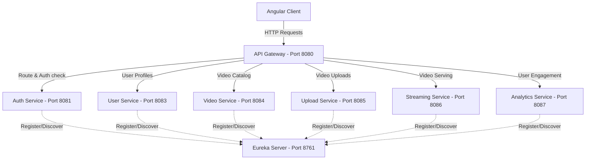

# 🎬 Video Streaming Microservices Backend

Welcome to the Backend Services for the Video Streaming Platform. This repository contains the complete microservices architecture designed to handle large-scale video uploads, metadata management, streaming, and user interactions.

---

## 🏗️ System Architecture

The backend is built as a distributed microservices system using **Spring Boot**, **Spring Cloud Netflix Eureka** for service discovery, and **Spring Cloud Gateway** as the API gateway.



---

## 🛠️ Tech Stack & Dependencies

- **Java Version:** 21
- **Framework:** Spring Boot 4.x / Spring Cloud (Release Train `2025.1.2`)
- **Service Discovery:** Netflix Eureka Server
- **Routing & Gateway:** Spring Cloud Gateway
- **Security:** Spring Security & JWT (JSON Web Tokens)
- **Data Persistence:** Spring Data JPA, PostgreSQL
- **Build Tool:** Maven

---

## 📁 Directory Structure & Microservices

Every microservice is a standalone Maven module located under the `backend/` directory:

| Service | Port | Description | Primary Dependencies |
| :--- | :--- | :--- | :--- |
| **`eureka-server`** | `8761` | Service Registry where all microservices register themselves for discovery. | `spring-cloud-starter-netflix-eureka-server` |
| **`api-gateway`** | `8080` | Entry point for the frontend clients. Handles cross-origin requests, routing, rate limiting, and request forwarding. | `spring-cloud-starter-gateway`, `eureka-client` |
| **`auth-service`** | `8081` | Handles user registration, authentication, token validation, and password hashing. | `spring-boot-starter-security`, `jjwt`, `postgresql` |
| **`user-service`** | `8083` | Manages user profiles, custom channels, and subscriber lists. | `spring-boot-starter-data-jpa`, `postgresql` |
| **`video-service`** | `8084` | Manages video catalogs, categories, titles, search indexes, and metadata. | `spring-boot-starter-data-jpa`, `postgresql` |
| **`upload-service`** | `8085` | Handles large file chunk uploads, triggers video processing/transcoding, and saves video binaries. | `spring-boot-starter-web`, `eureka-client` |
| **`streaming-service`** | `8086` | Provides adaptive streaming endpoints (HLS/DASH/MP4 serving) for low latency video playback. | `spring-boot-starter-web`, `eureka-client` |
| **`analytics-service`** | `8087` | Tracks views, watch durations, likes, comments, and engagement analytics. | `spring-boot-starter-data-jpa`, `postgresql` |

---

## 🚀 Getting Started

### Prerequisites

- **JDK 21** or higher installed.
- **Maven 3.9+** installed (or use the included wrapper `./mvnw` / `mvnw.cmd`).
- Running instance of **PostgreSQL** configured (default ports, username/password as required by service properties).

### Running Locally

To start the backend ecosystem, you must launch the services in order (Discovery first, then configuration/gateways, and finally the domain services):

1. **Start Eureka Server:**
   ```bash
   cd eureka-server
   ./mvnw spring-boot:run
   ```
   *Verify dashboard is running at http://localhost:8761/*

2. **Start API Gateway:**
   ```bash
   cd ../api-gateway
   ./mvnw spring-boot:run
   ```

3. **Start Security & Services:**
   Start the rest of the services as needed:
   ```bash
   # Authentication
   cd ../auth-service && ./mvnw spring-boot:run
   
   # Core domain services
   cd ../user-service && ./mvnw spring-boot:run
   cd ../video-service && ./mvnw spring-boot:run
   cd ../upload-service && ./mvnw spring-boot:run
   cd ../streaming-service && ./mvnw spring-boot:run
   cd ../analytics-service && ./mvnw spring-boot:run
   ```

---

## ⚙️ Building the Code

To compile, test, and package all services into executable JARs, run the Maven compile phase:

```bash
mvn clean package -DskipTests
```
The output JAR files will be generated in the respective target/ directories of each subproject.
